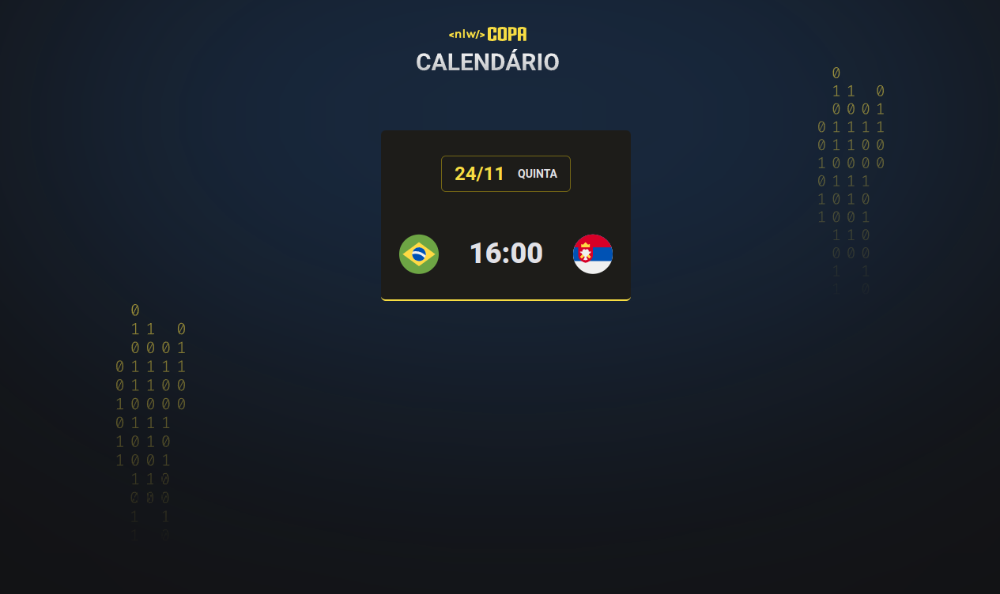

<h1 align="center">NLW - Copa (explorer)</h1>

 

## 🚀 Tecnologias

Esse projeto foi desenvolvido com as seguintes tecnologias:

- HTML 
- CSS

 
<h3 align="center">Tela Inicial</h3>

 
  

 

## 💻 Projeto

Projeto desenvolvido pela equipe da **Rocketseat** e apresentado pelo **Mayk Brito**. O projeto visa apresentar as tecnologias HTML e CSS.
A ideia é montar um calendário com todos os jogos da copa.
